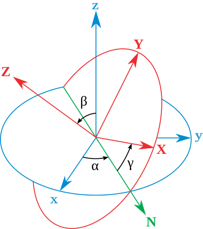

## 说明

项目尚处于开发初期, 并未正式上线; 目前文档中提到的硬件以及软件设计都是暂时的方案, 随着项目开发的推进, 随时可能修改 

## 关于本项目

本项目为基于`STM32`设计开发的一款四轴飞行器, 目标是设计为一个四轴飞行器, 以及配套的控制软件; 满足正常的飞行功能, 操作系统采用`RT-Thread` 

## 理论知识

#### 欧拉角

用来唯一地确定`定点转动刚体`位置的`三个一组`的独立角参量, 在本项目中, 也用来描述飞行器的位置; 有两组坐标, `xyz`为全局坐标, 保持不动, `XYZ`为局部坐标, 跟随物体一起运动 

 



 

刚体绕固定点的旋转可以看成是若干次旋转的合成, 并且旋转的方法不是唯一的, 这意味着欧拉角有不同的取法; 在使用欧拉角的过程中, 会不可避免地遇到`万向节死锁`的问题, 该问题体现在旋转自由度的缺失上 

#### 姿态解算

姿态解算的目的是计算出飞行器的俯仰角(Pitch), 滚转角(Roll)和偏航角(Yaw), 通过这些角度调整电机输出实现稳定飞行 

## 软件设计

#### 操作系统

选用国产嵌入式实时操作系统RT-Thread 

#### 任务设计与同步分析

pass 

#### 飞行控制软件

通过在飞控系统开发时预留接口, 实现后续飞行控制软件的开发, 首先是在Windows平台运行, 当然后续可能会在Android移植 

## 硬件设计

常见的四轴飞行器分为`X`型和`+`型, X型的飞行器机动性能更好(同样也更好找资料), 更好实现飞行控制, 所以本项目中我们将飞行器设计为X型 

#### 电机

2212 1000KV电机 

电机的转速为`KV值*电压`, 例如1000KV的电机在10V的电压下就是10000转/分钟, 当然这是在空转的情况下; 一般来讲KV值低的配较大的桨叶, KV值高的配较小的桨叶 

`22`指电机直径, `12`指电机机身长度; `2212`表示线圈外径22mm, 长度12mm 

#### 电调

选用30A电调, 30A表示持续最大电流承受能力; 电调根据飞控信号或油门输入调节提供给电机的电流和电压; 电调的电流承受能力必须大于或等于电机的最大电流需求 

#### 桨叶

选用1047桨叶 

10表示螺旋桨的`直径`为10英寸, 表示总长度; 47表示`螺距`, 意为在一整圈旋转中, 理论上可以推动空气前进的距离<br>

P指正旋螺旋桨, 表示顺时针(CW, Clockwise)方向旋转, 顺时针旋转时对飞行器产生向上的推力; R指反旋螺旋桨, 表示逆时针(CCW, Counter-Clockwise)方向旋转, 逆时针旋转时对飞行器产生向上的推力; 对角上的电机需要使用相反旋转方向的螺旋桨用以平衡扭矩 

#### 电源

选用2200mAh, 30C电源, 3S电源 

2200mAh表示电池容量, 意味着在一小时内放电2200毫安, 电池会完全放电 

30C表示电池的放电倍率, 意味着电池可以安全输出的最大电流为: 2200mAhx30C = 66A 

3S表示电源中有3节电池串联, 也就是11.1V(每个锂电池标称电压为3.7V) 

## 参考资料

[DIY组装无人机电机+电调+电池+桨叶搭配知识_电调电机电池搭配原则-CSDN博客](https://blog.csdn.net/m0_62458936/article/details/127206719) 

## 联系作者

如果在使用或者开发过程中有任何问题, 欢迎联系开发者`chenphxx`进行反馈 

```
E-Mail: john201950@outlook.com
```
